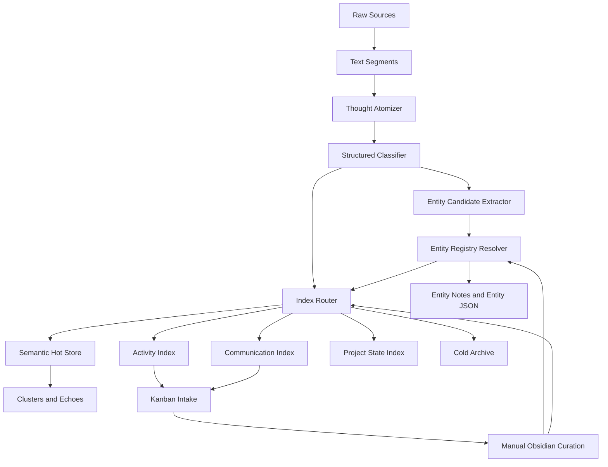

# ThoughtMap v2 — Semantic Processing PRD

## 1. Summary

ThoughtMap v2 turns raw daily notes, reviews, project notes, and Wispr dictations into a curated semantic memory system. The main change is moving from token/sentence chunking to **semantic thought atomization**: mixed journal sections are split into atomic thoughts before embedding, clustering, NER, and downstream indexes.

The system should treat raw text as evidence, structured output as interpretation, manual curation as truth, and generated prose as presentation.

## 2. Problem

The current pipeline extracts text, chunks it by sentence/token windows, embeds chunks, stores them in Chroma, clusters them, and then extracts entities. This works technically, but it creates noisy semantic maps because the unit of processing is not always a real thought.

Key problems:

- Daily `## Logs` and `## Dziennik` sections often mix multiple topics in one block.
- Current chunking can split by token boundaries while still mixing unrelated domains.
- Broad markdown ingestion pulls operational boilerplate and generated artifacts into the semantic index.
- NER creates many false positives because it operates on noisy chunks and lacks a strong manual source of truth.
- Manual Kanban curation exists, but only partially controls entities and generated tasks.
- Chroma grows over time with stale, duplicated, low-value, or incorrectly routed chunks.

## 3. Goals

1. Split mixed source text into atomic semantic units before embedding.
2. Use structured LLM outputs for segmentation, classification, entity candidates, relations, routing, and quality decisions.
3. Keep long generated prose out of the embedding source layer.
4. Promote manual Obsidian/Kanban curation into a durable source of truth.
5. Separate semantic memory from activity tracking, communication tracking, project state, and archive data.
6. Reduce data growth through routing, retention, deduplication, and hot/cold storage.
7. Improve NER precision through candidate verification, entity registry, aliases, retyping, rejection, and merge decisions.
8. Build a local model-optimization path for small fine-tuned extractors, entity resolvers, summarizers, and Vec2Text-style vector narration.
9. Build an annotation/data-preparation loop that turns automatic candidates into user-labeled training examples.

## 4. Non-Goals

- Reintroducing topology or ontology UI surfaces.
- Replacing Obsidian as the human editing surface.
- Sending ThoughtMap data to cloud models by default.
- Generating large synthetic summaries and treating them as primary evidence.
- Building a perfect universal taxonomy in the first iteration.
- Deleting historical data without an explicit rebuild or retention policy.

## 5. Product Principles

| Principle | Meaning |
|---|---|
| Raw text is evidence | Original notes and transcripts remain the ground truth. |
| Structured output is interpretation | LLM outputs should be JSON-like classifications and extracted facts, not freeform replacements. |
| Manual curation is truth | User decisions override model decisions on entities, domains, routing, and suppressions. |
| Generated prose is presentation | Summaries and labels help humans navigate, but should not become the primary embedding corpus. |
| Local-first by default | Ollama, Chroma, local markdown, and local SQLite remain the default runtime. |

## 6. Current System

Current pipeline:

```text
extract_all
  -> chunk_all
  -> embed_batch
  -> merge_similar_chunks
  -> store_chunks
  -> load_all_embeddings
  -> cluster_all
  -> semantic artifacts / entities / report / UI / kanban
```

Current limitations:

- `core/extract.py` splits daily logs mostly by timestamp and section.
- `core/chunk.py` splits text by sentence/token windows, not by topic.
- `analysis/ner.py` combines regex cache, spaCy, project heuristics, manual alias overrides, LLM validation, and summaries, but validation is still noisy.
- `analysis/kanban.py` syncs manual suppressions and title/entity alias overrides, but does not yet act as a full entity/thought/domain registry.
- `core/embed.py` loads all stored Chroma items for clustering, so stale records remain active until pruned or rebuilt.

## 7. Target System

Target pipeline:

```text
source extraction
  -> deterministic section parsing
  -> semantic thought segmentation
  -> structured classification
  -> entity and relation candidate extraction
  -> curation registry application
  -> index routing
  -> embedding for semantic thoughts only
  -> clustering / entity maps / communication maps / project state / reports
```

Mermaid view:



## 8. Core Data Model

### 8.1 TextSegment

Existing extraction unit. Represents a block from a source file or transcript before semantic splitting.

Required fields:

```json
{
  "segment_id": "stable hash",
  "source": "obsidian-daily | wispr-flow | second-brain | review | project-note",
  "source_file": "Second Brain/...",
  "section": "Logs | Dziennik | Projects | ...",
  "timestamp": "2026-04-28T10:12:00",
  "text": "raw extracted text"
}
```

### 8.2 ThoughtAtom

New semantic unit. This becomes the primary object for routing, embedding, clustering, and curation.

```json
{
  "atom_id": "stable hash",
  "parent_segment_id": "segment hash",
  "source_offsets": {"start": 0, "end": 742},
  "text": "original text span for this thought",
  "title": "short generated title",
  "summary": "optional one-sentence summary",
  "language": "pl | en | mixed",
  "signal_type": "thought | decision | task | communication | research | project_update | boilerplate | generated_output",
  "domains": [
    {"id": "fenix", "confidence": 0.92},
    {"id": "ai_rd", "confidence": 0.63}
  ],
  "index_targets": ["semantic", "project", "entity"],
  "entity_candidates": [],
  "relation_candidates": [],
  "quality": "keep | low_value | duplicate | boilerplate | needs_review",
  "curation_state": "auto | verified | rejected | edited",
  "confidence": 0.86
}
```

### 8.3 EntityCandidate

```json
{
  "name": "Konrad Bujak",
  "type": "person | organization | project | tool | location | concept",
  "canonical_name": "Konrad Bujak",
  "aliases": ["Konrad"],
  "evidence_span": "fragment from source text",
  "source_atom_id": "atom hash",
  "confidence": 0.88,
  "decision": "candidate | verified | rejected | retype | merge"
}
```

### 8.4 RelationCandidate

```json
{
  "subject": "Konrad Bujak",
  "predicate": "related_to_project | awaiting_reply | owns_task | mentioned_in_context | collaborates_with",
  "object": "Fenix",
  "status": "candidate | verified | rejected",
  "timestamp": "2026-04-28",
  "evidence": "source text span",
  "confidence": 0.76
}
```

### 8.5 EntityRegistry

Durable manual source of truth. Stored outside generated outputs.

Suggested path:

```text
Second Brain/Projects/thoughtmap/data/curation/entity_registry.json
```

Suggested shape:

```json
{
  "entities": {
    "person:konrad-bujak": {
      "canonical_name": "Konrad Bujak",
      "type": "person",
      "aliases": ["Konrad"],
      "status": "verified",
      "source": "manual",
      "updated_at": "2026-04-28"
    }
  },
  "rejected": {
    "concept:acceptance-criteria": {
      "reason": "generic concept, not named entity",
      "updated_at": "2026-04-28"
    }
  },
  "merges": {
    "person:k-bujak": "person:konrad-bujak"
  }
}
```

## 9. Functional Requirements

### FR1 — Semantic Thought Atomization

The system shall split mixed source segments into atomic thoughts before chunking and embedding.

Requirements:

- Apply deterministic splitting first: headings, timestamps, bullets, blank lines, task markers, markdown tables.
- Trigger LLM segmentation for long or mixed segments.
- Preserve source offsets and parent segment IDs.
- Avoid paraphrasing the source text as the primary atom text.
- Assign each atom a stable ID based on source identity and normalized text.

Acceptance criteria:

- A daily `Dziennik` block containing multiple topics produces multiple ThoughtAtoms.
- Each atom links back to its source file, section, timestamp, and parent segment.
- Embedding uses atom text, not the full mixed parent segment.

### FR2 — Structured Output First

The system shall use structured LLM outputs for preprocessing.

Structured tasks:

- thought segmentation
- signal classification
- domain assignment
- index routing
- entity candidate extraction
- relation candidate extraction
- quality classification
- short title generation

Constraints:

- LLM output must be parsed as JSON or a schema-equivalent structure.
- Invalid output must fail closed into `needs_review`, not silently pollute the semantic store.
- Generated summaries must be short and must not replace evidence text.

Acceptance criteria:

- The segmentation module emits valid JSON for test fixtures.
- Invalid JSON is logged and routed to review without breaking the pipeline.
- Long generated prose is not embedded as source evidence.

### FR3 — Index Routing

The system shall decide which indexes receive each ThoughtAtom.

Index targets:

| Target | Purpose | Examples |
|---|---|---|
| `semantic` | Long-term topic memory | insights, decisions, project thinking |
| `entity` | Entity evidence | people, organizations, tools, projects |
| `communication` | Contact and thread tracking | follow-ups, unanswered messages, stakeholder mentions |
| `activity` | Tasks and operational loops | TODOs, carry-forward, status gaps |
| `project` | Project state | decisions, blockers, milestones |
| `archive` | Low-frequency historical evidence | old but valid source text |
| `discard` | Excluded from active processing | boilerplate, generated artifacts, logs without semantic value |

Acceptance criteria:

- Boilerplate and generated ThoughtMap outputs are not embedded into the semantic index.
- Communication atoms can feed communication maps without becoming dominant semantic clusters.
- Project update atoms can update project-specific views without flooding general clustering.

### FR4 — Entity Registry and NER Precision

The system shall treat spaCy and LLM NER as candidate generation, not truth.

Requirements:

- Load entity registry before NER resolution.
- Apply verified aliases and canonical names before deduplication.
- Apply rejected entities before output generation.
- Support manual decisions: verify, reject, retype, merge, alias, rename.
- Keep communication/project entities distinct from generic semantic concepts.

Acceptance criteria:

- Rejected false positives do not reappear after reruns.
- Manual aliases affect entity notes and `_entity-index.md`.
- Retyped entities move to the correct entity category.
- Merge decisions collapse duplicate entities across runs.

### FR5 — Manual Curation Surfaces

The system shall expose model uncertainty through Obsidian-editable curation surfaces.

Required surfaces:

| Surface | Purpose |
|---|---|
| `ThoughtMap Intake.md` | Action/task/communication candidate triage. |
| `ThoughtMap Entity Curation.md` | Verify, reject, merge, alias, and retype entity candidates. |
| `ThoughtMap Segment Curation.md` | Mark atoms as keep, split needed, wrong domain, boilerplate, discard. |
| `ThoughtMap Domain Curation.md` | Review domain assignments and emerging domain labels. |

Requirements:

- Generated cards must include stable hidden tracking IDs.
- Deleted or moved cards must update curation JSON.
- Manual curation must be applied before the next generated output.
- Manual decisions must not be overwritten by regeneration.

Acceptance criteria:

- Moving an entity card to `Reject` writes a rejected registry entry.
- Renaming an entity card updates canonical name or aliases.
- Marking a segment as `Discard` prevents it from active semantic embedding.
- Marking a segment as `Split needed` sends it back to segmentation review.

### FR6 — Data Reduction and Storage Tiers

The system shall limit active store growth and keep cold evidence available.

Hot store:

- verified semantic atoms
- recent high-confidence project updates
- recent communication/action candidates
- active entity evidence

Cold store:

- old raw source snapshots
- low-frequency historical atoms
- discarded but auditable records
- generated artifacts from prior runs

Reduction mechanisms:

- stable source hashing
- exact text deduplication
- near-duplicate Echoes grouping
- retention by index target
- pruning stale Chroma entries no longer present in the active manifest
- excluding generated output directories from ingestion

Acceptance criteria:

- A rebuild can produce an active manifest of atoms intended for Chroma.
- Chroma contains only active semantic records after prune/rebuild.
- Cold records remain inspectable as JSON/markdown evidence but are not clustered by default.

### FR7 — Observability and Auditability

The system shall report what it kept, discarded, routed, and asked the user to review.

Required outputs:

- `thought_atoms.json`
- `thought_atom_manifest.json`
- `entity_candidates.json`
- `entity_registry.json`
- `relation_candidates.json`
- `routing_report.json`
- `curation_report.md`

Acceptance criteria:

- Each run reports counts by source, signal type, domain, index target, and quality.
- The report lists top rejected reasons.
- The report lists top uncertain atoms/entities requiring curation.

### FR8 — Fine-Tuned Model Layer

The system shall support optional local fine-tuned models for repeated structured tasks.

Target models:

| Model | Purpose |
|---|---|
| Entity Type Resolver | Fix person/organization/location/project/tool/concept confusion. |
| Atomizer / Router | Split source segments and assign signal type, domain, and index targets. |
| Summary / Labeler | Generate short faithful cluster/entity labels and summaries. |
| Vec2Text / Vector Narrator | Describe embeddings, centroids, and vector directions for interpretability. |

Supporting product surface:

- annotation UI in the existing web app,
- generated `ThoughtMap Annotation Queue.md`,
- local annotation/task store under `data/annotations/`,
- dataset compiler from accepted annotations into train/eval JSONL.

Requirements:

- Fine-tuned models must be optional and local-first.
- Manual curation and entity registry decisions must override model output.
- Model outputs must be schema-validated before entering pipeline state.
- Training data and LoRA adapters should be treated as private runtime artifacts by default.
- Baselines must be recorded before fine-tuning so improvements are measurable.
- Generated ThoughtMap output may create candidate annotation tasks, but must not be treated as gold training truth without explicit user annotation or durable registry confirmation.
- Gemini/OpenAI/local LLM annotations may be used as preannotations or silver labels, but must be stored separately from user gold labels.

Acceptance criteria:

- Entity Type Resolver beats the generic-prompt baseline on a curated eval set.
- Organization/location confusion is explicitly measured and reduced.
- Atomizer / Router improves manual atom-purity and routing scores.
- Summary / Labeler outputs are shorter and more faithful than the current generic model baseline.
- Vec2Text is used for vector interpretation, not as source truth.
- Annotation tasks explain what the user is deciding, which fields are editable, and what makes a good label.

### FR9 — Annotation and Training Data Preparation

The system shall convert ThoughtMap candidates into training data through explicit annotation.

Requirements:

- Generate annotation tasks from entity candidates, atom splits, routing decisions, summaries, relations, and vector narration candidates.
- Provide a simple web annotation surface and an Obsidian Kanban annotation queue.
- Explain each task type to the user: what is being decided, which fields are editable, and what makes a good label.
- Store annotation tasks, user decisions, and assisted model suggestions under local `data/annotations/`.
- Treat user decisions and durable registry decisions as gold labels.
- Treat ThoughtMap-generated candidates as proposals, not truth.
- Treat Gemini/OpenAI/local-model suggestions as preannotations or silver labels unless the user accepts them.
- Export task-specific JSONL datasets with gold, silver, hard-negative, and eval splits kept separate.

Acceptance criteria:

- `entity_type_resolution` tasks can be generated from current `entities.json`, registry decisions, and source snippets.
- `/annotate` or `/annotate/entities` supports constrained entity labeling.
- `ThoughtMap Annotation Queue.md` lists pending annotation work for Obsidian triage.
- Dataset export creates train/eval JSONL plus a manifest with counts and split policy.
- Cloud preannotation is opt-in and recorded with provider, model, and prompt version.

## 10. LLM Usage Policy

Use LLMs for:

- segmentation into atomic thoughts
- structured classification
- entity candidate extraction
- relation candidate extraction
- short titles
- short summaries for UI/navigation
- cluster/entity labels after analysis

Avoid LLMs for:

- rewriting source evidence before embedding
- generating long synthetic records that enter the semantic store
- overriding manual curation
- deciding permanent truth without registry confirmation when confidence is low

Default runtime:

- Local Ollama models only.
- Cloud providers remain opt-in and explicit.

## 11. UX Requirements

### Obsidian

- Curation boards should be readable and editable in Obsidian.
- Cards should contain concise titles, source snippets, and hidden tracking metadata.
- Curation should feel like reviewing candidates, not editing machine files.

### Web UI

- Keep current condensed/search/entity/taxonomy/echoes surfaces.
- Do not re-add topology or ontology tabs.
- Node click should update scope but not automatically open search.
- Add review affordances only after the underlying curation registry exists.

## 12. Technical Design

### New Modules

Suggested files:

```text
core/segment.py              # ThoughtAtom creation from TextSegment
analysis/classify.py         # structured signal/domain/index classification
analysis/entity_registry.py  # manual truth registry load/apply/write
analysis/relations.py        # relation candidate extraction and resolution
analysis/routing.py          # index routing and retention decisions
analysis/curation.py         # Obsidian curation board generation/sync
analysis/storage_tiers.py    # hot/cold manifest and Chroma prune planning
training/datasets.py         # local dataset builders for fine-tuning/evaluation
training/evaluate.py         # task metrics and baseline comparisons
training/model_cards.py      # local model-card metadata for private adapters
annotation/tasks.py          # annotation task schemas and validation
annotation/generate.py       # create annotation tasks from ThoughtMap candidates
annotation/store.py          # append/load/update annotation records
annotation/export.py         # compile accepted labels into train/eval JSONL
annotation/preannotate.py    # optional local/Gemini/OpenAI preannotation
```

### Pipeline Change

Target `run.py` sequence:

```text
segments = extract_all()
atoms = atomize_segments(segments)
classified_atoms = classify_atoms(atoms)
entity_candidates = extract_entity_candidates(classified_atoms)
entity_registry = load_entity_registry()
resolved_entities = resolve_entities(entity_candidates, entity_registry)
routed_atoms = route_atoms(classified_atoms, resolved_entities)
chunks = chunk_atoms_for_embedding(routed_atoms where target includes semantic)
embeddings = embed_batch(new_semantic_texts)
store_chunks(active_semantic_chunks, embeddings)
prune_inactive_chroma_records(active_manifest)
cluster_all(active_semantic_items, embeddings)
generate_reports_and_curation_outputs()
```

### Compatibility

- Existing `Chunk` can remain as the embedding unit.
- `Chunk` should reference `atom_id` and `parent_segment_id`.
- Existing NER can be kept as a candidate source during migration.
- Existing Kanban curation should be preserved and extended, not removed.

## 13. Phased Implementation

### Phase 1 — Prototype Thought Atoms

Scope:

- Add `ThoughtAtom` model and `thought_atoms.json` output.
- Run segmentation on a limited sample: daily notes, reviews, Wispr entries.
- Keep existing Chroma/cluster pipeline unchanged.

Acceptance:

- 10 mixed daily/review segments produce plausible atoms.
- Atoms preserve source links and timestamps.
- JSON output is inspectable and stable across reruns for unchanged sources.

### Phase 2 — Structured Routing

Scope:

- Add signal/domain/index classification.
- Produce `routing_report.json`.
- Exclude boilerplate/generated artifacts from semantic embedding in a dry-run mode.

Acceptance:

- Report shows counts by source, signal type, domain, and target.
- Exclusion decisions are reviewable before pruning Chroma.

### Phase 3 — Entity Registry MVP

Scope:

- Add `entity_registry.json`.
- Apply verified/rejected/alias/retype/merge decisions before entity output generation.
- Generate `ThoughtMap Entity Curation.md`.

Acceptance:

- Rejected entities stay rejected across reruns.
- Aliases and canonical names affect generated entity notes.
- Entity index has visibly fewer false positives.

### Phase 4 — Semantic Store Migration

Scope:

- Embed semantic atoms instead of raw chunks.
- Add active manifest.
- Add Chroma prune/rebuild command.

Acceptance:

- Chroma active count aligns with active manifest.
- Clusters become more coherent for mixed daily notes.
- Generated output directories are excluded from ingestion.

### Phase 5 — Full Curation Loop

Scope:

- Add Segment, Domain, and Entity curation boards.
- Sync board changes into curation JSON.
- Apply curation before each run.

Acceptance:

- Manual board decisions affect next pipeline run.
- Generated outputs do not overwrite manual truth.
- Curation report lists applied decisions.

### Phase 6 — Local Model Optimization

Scope:

- Build a simple annotation/data-preparation UI and queue before training.
- Build JSONL dataset builders from curation boards, entity registry, ThoughtAtoms, and source snippets.
- Establish baselines for entity typing, routing, summarization, and vector narration.
- Train the first optional small model: Entity Type Resolver.
- Add config gates for local fine-tuned models without making them required.
- Prepare Vec2Text training data only after the embedding model and active Chroma manifest are stable.

Acceptance:

- `data/annotations/` contains durable task and user-label records.
- `ThoughtMap Annotation Queue.md` exposes pending labels as reviewable work.
- The web annotation surface supports at least entity type resolution with constrained editable fields.
- `data/training/` contains deterministic train/eval splits.
- Hard negatives are tagged for entity type confusions.
- Fine-tuned model metrics are compared against rule and generic-prompt baselines.
- Runtime falls back to deterministic rules and curation if the model is unavailable or invalid.
- See [Model Optimization and Fine-Tuning Plan](docs/model-optimization-finetuning-plan.md) and [Annotation and Data Preparation Framework](docs/annotation-data-preparation-framework.md) for the detailed roadmap.

## 14. Success Metrics

Quality metrics:

- Fewer false-positive entities in `_entity-index.md`.
- Higher cluster coherence for daily/review content.
- Lower share of `unclassified` and `misc` atoms.
- Lower boilerplate/generated-output presence in semantic clusters.

Operational metrics:

- Active Chroma item count stabilizes or grows slowly.
- Reruns are incremental and explain what changed.
- Manual rejections persist across reruns.
- Curation workload stays small enough for daily/weekly review.

Suggested first benchmark:

- Sample 20 mixed daily/review sections.
- Compare current chunk output vs ThoughtAtom output.
- Manually score topic purity, entity precision, and routing correctness.

## 15. Risks

| Risk | Mitigation |
|---|---|
| LLM segmentation hallucinates structure | Preserve original text spans and source offsets; fail to review on invalid output. |
| Too much manual curation overhead | Only surface uncertain/high-impact candidates; auto-accept high-confidence low-risk cases. |
| Registry becomes complex | Start with entity registry only; add segment/domain curation after routing works. |
| Chroma prune deletes useful context | Dry-run prune first; keep cold archive and rebuild command. |
| Domain labels drift over time | Keep domain registry and allow manual aliases/merges. |
| Runtime becomes slow | Gate LLM segmentation by segment length/mixed-domain heuristics; cache structured outputs by source hash. |
| Fine-tuned models memorize private notes | Keep training data/adapters local, document training sources, and avoid uploading adapters by default. |
| Fine-tuned model output looks confident but wrong | Apply manual registry first, schema-validate outputs, and route uncertain cases to curation. |
| Generated artifacts are mistaken for truth | Treat ThoughtMap output as candidate/proposal data; require user annotation or registry confirmation for gold labels. |
| Cloud preannotation leaks private notes | Make Gemini/OpenAI preannotation explicit opt-in, record provider/model, and default to local models for private content. |

## 16. Open Questions

- What confidence threshold should auto-route a ThoughtAtom into the semantic index?
- Should communication atoms be embedded in a separate collection or kept as JSON-only activity data?
- Should entity registry live under `data/curation/` or in `Second Brain/Operations/thoughtmap-out/curation/`?
- Should ThoughtAtom text preserve exact original text, or allow minimal cleanup before embedding?
- How often should cold storage be compacted or archived?
- Should accepted domains be curated as a flat registry first, before any deeper taxonomy work?
- Which small local model should be the first fine-tuning target: Entity Type Resolver or Atomizer / Router?
- Should entity typing use a decoder LoRA model or a cheaper encoder classifier?
- How much curated gold data is enough before training the first production adapter?
- What is the minimum annotation UI needed before the first dataset export?
- Which annotation task types should be cloud-preannotation eligible, and which must remain local-only?

## 17. Immediate Next Step

Build a read-only prototype that writes `thought_atoms.json` and `routing_report.json` from 10-20 recent daily/review/Wispr segments without changing Chroma. Use this to validate segmentation quality before migrating the production embedding pipeline.
